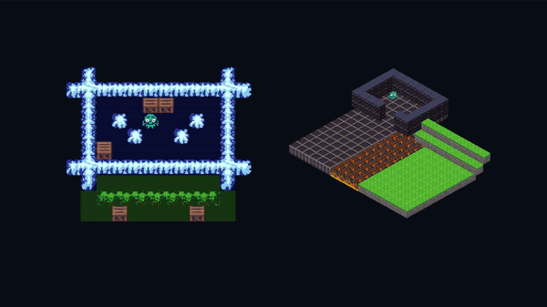

# FDV-tiles

## Actividad Tilemaps

Actividades a realizar:

- Obtener assets que incorpores a tu proyecto para la generación del mapa: planos e isométricos.
- Incorporar los recursos del punto 1 en el proyecto y generar al menos 2 paletas, para cada uno de los dos tipos de mapas.
- Generar un mapa convencional, incluir obstáculos y paredes.
- Generar un mapa isométrico, generar zonas elevadas y obstáculos.
